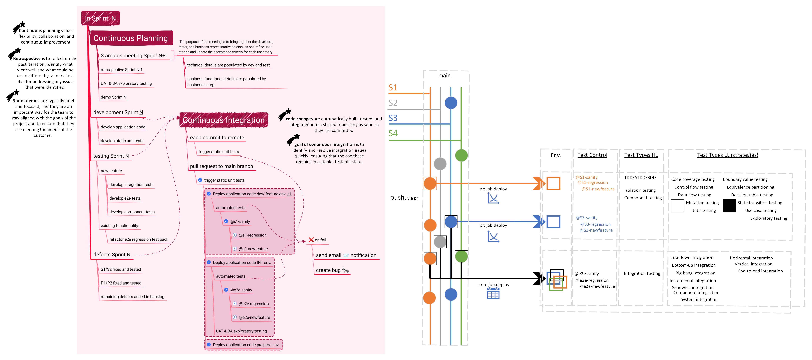
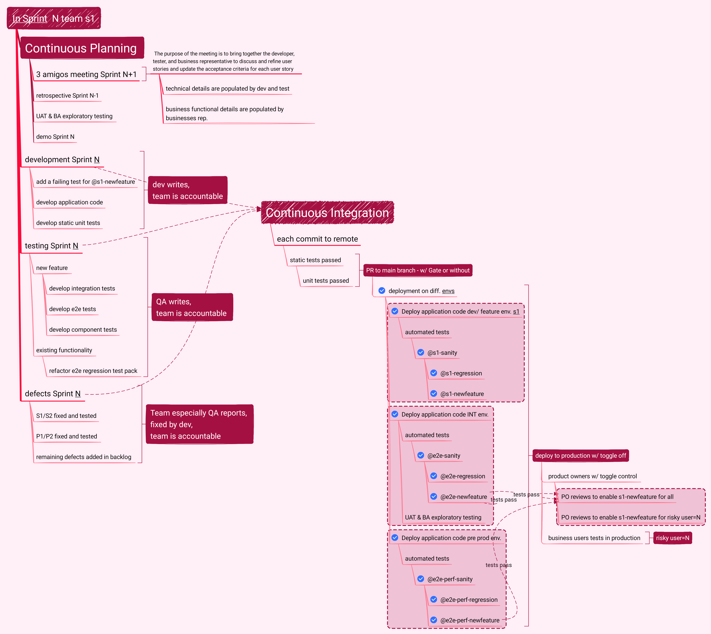
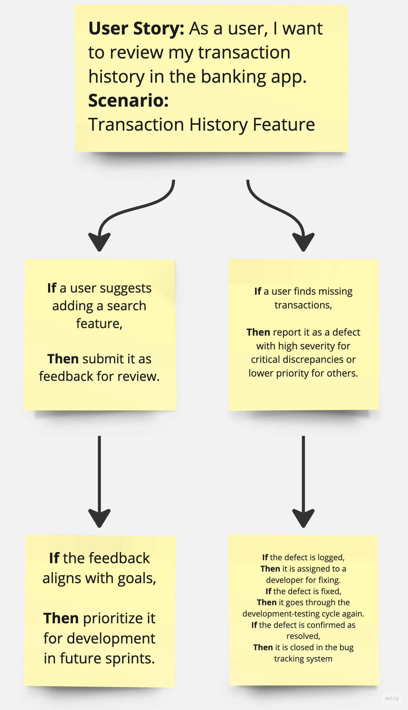

# Diagrams catalog

All diagrams are centralized in this folder for quick reference. Each entry includes a short explanation of the intent and how to read the diagram.

## Automated testing function

Shows where automated testing fits across the delivery pipeline. Use it as a compact visual for test scope and the placement of automation within delivery stages.

Source: `source/automated-testing-function.vsdx`.

## Continuous planning & CI/CD flow (expanded)

Illustrates how continuous planning feeds development, testing, and CI, with deployment gates and test stages. Use it to explain the end-to-end lifecycle from planning through production rollout and test strategy selection.

## Continuous planning & CI/CD flow (compact)

A simplified variant of the continuous planning/CI flow that highlights the core collaboration and deployment steps without the extra annotations. Use it for quick introductions or summaries.

## QE tools, principles, and automation strategy

A high-level landscape of QE tools, testing principles, automation practices, and strategy documentation. Use it as a quick reference for aligning tool selection and automation-first guidance.

## Feedback vs defects logging: scenario 1

Shows how a performance requirement can lead to feedback or a defect depending on whether the issue is an enhancement or a failure to meet a technical requirement.

## Feedback vs defects logging: scenario 2

Uses a login UX example to contrast new feature feedback (e.g., password reset link) versus defects that should be logged for fixes.

## Feedback vs defects logging: scenario 3

Uses a transaction history example to show how user suggestions become feedback, while missing data is treated as a defect requiring triage.

## Sources

- `source/e2e-requirement-flow.vmind` — editable source for the continuous planning/CI pipeline diagram.
- `source/automated-testing-function.vsdx` — editable source for the automated testing function diagram.
